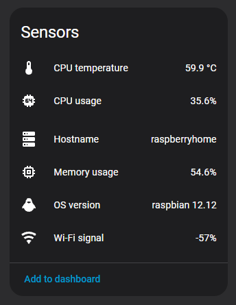

# GoMetrum

A lightweight system metrics agent written in Go.

**GoMetrum collects host-level metrics and publishes them to Home Assistant using MQTT Discovery.**

The project focuses on **explicit configuration**, **deterministic behavior**, and **low runtime overhead**, while avoiding implicit defaults and hidden logic.

    

## Documentation

**Project documentation:**

- [Installation](docs/installation.md)
- [Configuration](docs/configuration.md)
- [Running GoMetrum](docs/running.md)
- [Command-line interface](docs/cli.md)

## Overview

GoMetrum is a background agent designed to run on Linux hosts and report system-level metrics to Home Assistant.

Key characteristics:

- single explicit YAML configuration file,
- sensors enabled **only by presence**,
- predictable Home Assistant entity set,
- clean startup and shutdown behavior.
- publishes states via MQTT,

## Explicit configuration model

Each sensor exists **only if it is explicitly defined** in the configuration file.

There are:

- no global enable/disable switches,
- no implicit or auto-generated sensors,
- no “magic defaults”.

As a result:

- the number of Home Assistant entities is always predictable,
- the configuration file fully describes the resulting system state,
- behavior is deterministic and easy to reason about.

## Features

- System metrics collection (CPU, memory, disk, network, GPU)
- Explicit per-sensor configuration
- Per-sensor refresh intervals
- MQTT retained state publishing
- Home Assistant MQTT Discovery integration
- Availability reporting (`online` / `offline`)
- Discovery cleanup (`--purge` mode)
- Low runtime overhead

## Technologies

Project is created with:

- Go 1.25.1
- MQTT (Eclipse Paho client)
- Home Assistant MQTT Discovery
- gopsutil
- systemd (optional)

## Status

The project is in active development.
